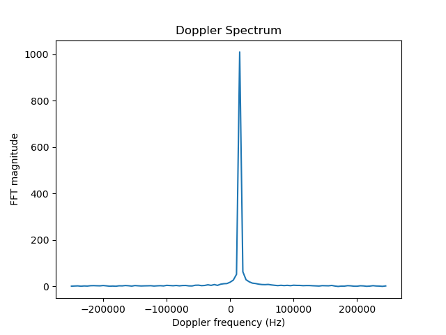

# FMCW-Radar-Simulation

Detects the range and radial velocity of a single target using a simulated frequency modulated continuous wave (FMCW) radar. 

---

## Features

- Simulates an FMCW radar system.
- Generates a complex baseband intermediate-frequency (IF) signal by mixing the transmitted chirps as they are sent, and the  received chirps as they are received from the moving target.
- Adds complex Gaussian noise, and attenuation.
- Uses fast-time FFT for range estimation.
- Uses slow-time FFT for Doppler velocity estimation.
- Plots the Doppler frequency spectrum.


## Dependencies

This script uses:

- NumPy
- SciPy
- Matplotlib

To install using `conda`:

```bash
conda install numpy matplotlib scipy
```

## Example Output



## Notes

This is a simplified model with a single target intended for exploration of FMCW radar signal processing rather than to reproduce a fully realistic radar system.

Further features may be implemented such as multiple target detection, angular estimation, range Doppler mapping, and animation .


